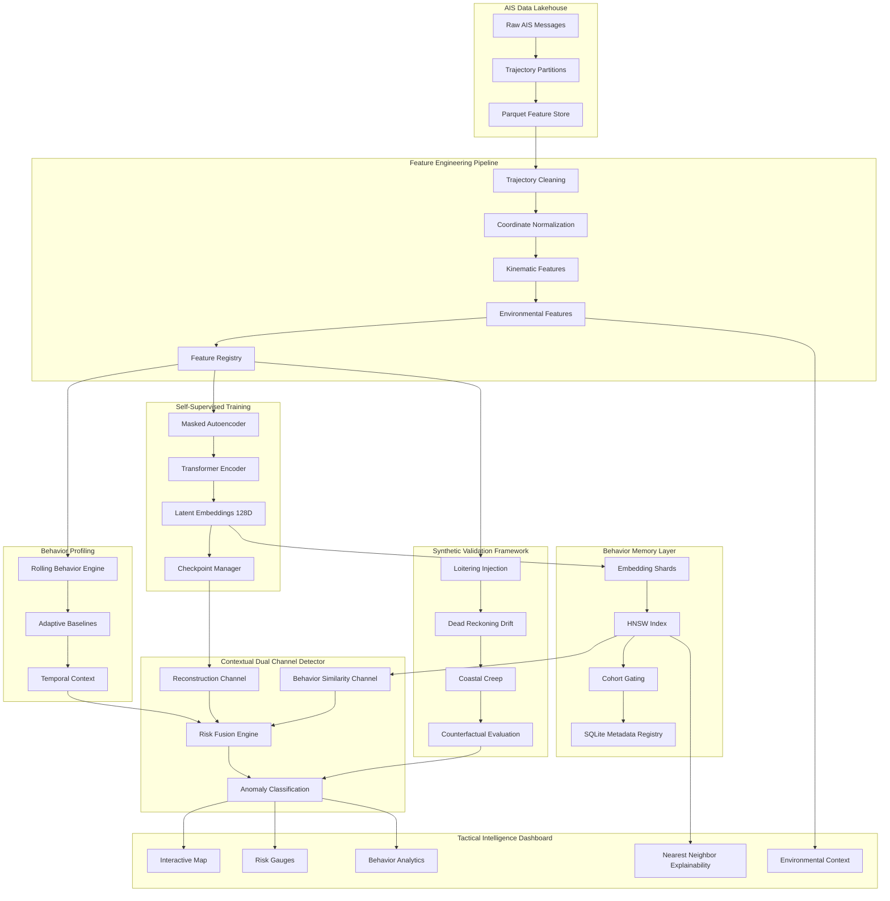
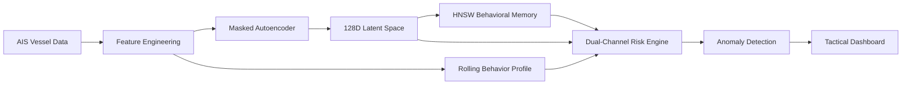
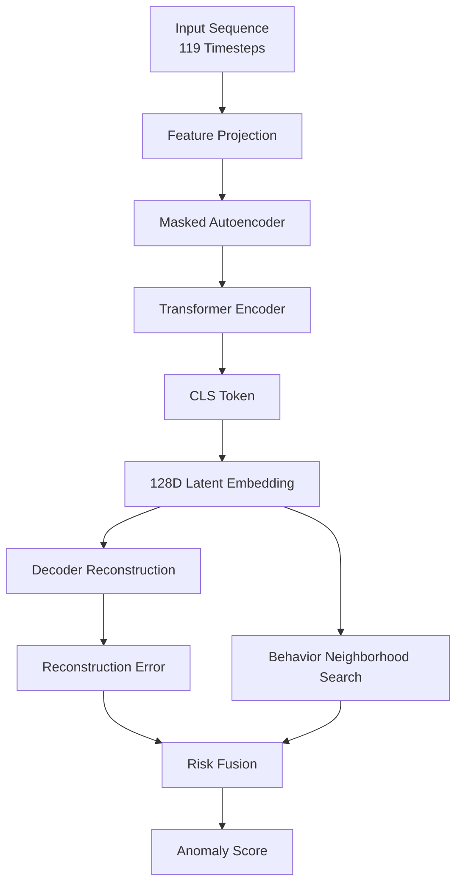
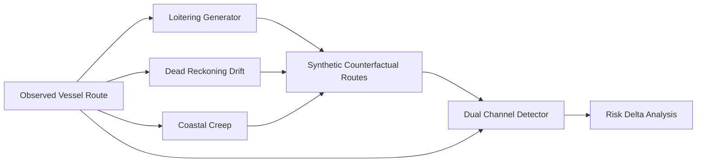

<div align="center">


```
   ███╗   ██╗ █████╗ ██╗   ██╗██╗███████╗██╗ ██████╗ ██╗  ██╗████████╗
   ████╗  ██║██╔══██╗██║   ██║██║██╔════╝██║██╔════╝ ██║  ██║╚══██╔══╝
██╔██╗ ██║███████║██║   ██║██║███████╗██║██║  ███╗███████║   ██║
██║╚██╗██║██╔══██║╚██╗ ██╔╝██║╚════██║██║██║   ██║██╔══██║   ██║
██║ ╚████║██║  ██║ ╚████╔╝ ██║███████║██║╚██████╔╝██║  ██║   ██║
╚═╝  ╚═══╝╚═╝  ╚═╝  ╚═══╝  ╚═╝╚══════╝╚═╝ ╚═════╝ ╚═╝  ╚═╝   ╚═╝
```

**Contextual Spatiotemporal Foundation Model Platform for Maritime Anomaly Intelligence** 

*Piraeus Operational Corridor Dataset · 2017–2019 · Out-of-Core Processing Stream*

[](https://python.org)
[](https://pytorch.org)
[](https://pola.rs)
[]()
[](LICENSE)

</div>

---

## 🛰️ Platform Overview

**NaviSight AI** is a research-grade production spatiotemporal platform and deep foundation model architecture engineered for continuous, out-of-core maritime trajectory representation learning. Traditional tracking frameworks rely on rigid, rule-based speed thresholds or shallow clustering techniques that evaluate movement patterns in isolation. This leads to massive false-alarm spikes caused by environmental variations (e.g., a cargo vessel slowing down to navigate a narrow strait or weather system).

NaviSight AI fixes this limitation by building a self-supervised **Trajectory Masked Autoencoder (Traj-MAE)**. The system conditions physical kinematic vectors on three synchronized metadata domains: **hierarchical vessel taxonomy profiles, local geodetic geography structures, and continuous spatial weather fields**. By analyzing how these elements interact across years of historical tracking logs from the Piraeus coastal corridor, the architecture learns to world-model normal operations, suppressing environmental false positives while identifying genuine behavioral anomalies down to exact physical root causes.

---

## 📐 Core Mathematical & Geospatial Modeling

### 1. Continuous-Time Stochastic System Formulations
Vessel trajectory dynamics are represented as a **Continuous-Time Stochastic Hybrid System** operating inside local tangent planes. Instead of manipulating un-normalized latitude and longitude coordinates directly, the model evaluates state dynamics via an active state vector:

$$x_t = [p_x, p_y, v, \theta, \mathbf{z}]^T$$

Where $p$ represents metric East-North-Up (ENU) position offsets, $v$ tracks forward physical velocity, $\theta$ isolates true manifold heading, and $\mathbf{z}$ governs an underlying continuous latent regime logit matrix. Trajectory state transitions follow a multi-variate stochastic differential equation (SDE):

$$dx_t = f(x_t, t)dt + g(x_t, t)dW_t$$

Where $dW_t$ represents a multivariate Brownian noise vector tracking environmental disturbances.

### 2. Shortest-Path Geodesic Unwrapping Lookups
Standard Euclidean distance metrics generate non-physical data jumps near the international dateline ($\pm180^\circ$). NaviSight AI resolves longitudinal transitions natively using **Modular Angular Distance** unwrapping equations:

$$\Delta \lambda = ((\lambda_2 - \lambda_1 + 180) \bmod 360) - 180$$

This guarantees a continuous $C^2$ spatial manifold wrapper across coordinate boundaries. 

### 3. Multi-Branch Positional Trajectory Encodings
To prevent token permutation errors within the self-attention mechanism, temporal steps are passed into three parallel tracking branches:
* **Absolute Position Index Branch:** Maps sequence indices within the rolling window context.
* **Continuous Local Delta Branch:** Tracks localized velocity variation by encoding step time-deltas ($\Delta t$).
* **Continuous Cumulative Timeline Branch:** Captures long-term journey progression via an active trip integration sum ($t_{cum} = \sum \Delta t$).

---

## 🛠️ Data Schema Contract

The ingestion framework enforces strict type safety, parsing 62 explicit features out-of-core. Columns are categorized across four semantic groups:

| Modality Namespace | Selected Target Fields | Technical Description | Transformation Rule |
| :--- | :--- | :--- | :--- |
| **PHYSICS** | `speed_raw`, `actual_speed_knots`, `course_change`, `turn_rate`, `jerk`, `acceleration`, `delta_x_nm`, `delta_y_nm` | Kinematic spatial derivatives and local tangent coordinate plane shifts. | Cohort-Stratified Z-Score Normalization |
| **WEATHER** | `wind_speed`, `temperature`, `pressure`, `headwind_component`, `crosswind_component` | Continuous meteorological variables from NOAA GFS spatial grids. | Robust Centered Scaling |
| **CONTEXT** | `hour_sin`, `hour_cos`, `voyage_phase_cruising`, `vessel_superclass_id`, `shiptype` | Cyclic temporal values, one-hot operational status, and taxonomy details. | Passthrough / Int-Mapping |
| **QUALITY** | `flag_speed_anomaly`, `flag_position_jump`, `reliability_score` | Binary quality filters and a continuous asset reliability index `[0.0, 1.0]`. | Dynamic Penalty Deduction |

---

## 📋 The Forensic Debugging Story

NaviSight’s core framework was stabilized following a forensic debugging campaign that traced a **15-bug causal chain** responsible for complete training collapse. The structural breakdown and subsequent architectural fixes included:

1. **The String Membership Vulnerability (`in` vs `==`):** The initial preprocessing loop checked feature names using Python's `in` operator (e.g., `if 'lon_raw' in feat_name`). This triggered accidental substring matches on features like `acceleration` and `log_time_diff`, routing raw physics columns to a geographic bounding-box scaler instead of their cohort statistics. This delivered near-zero feature variance to the encoder. **Fix:** Replaced with explicit `==` equality constraints.
2. **The Loss Target Shifting Bug:** The tracking attribution collector utilized a zip expression: `zip(REGISTRY.maskable_for_loss, mean_feature_errors)`. The error array contained the full 41 model dimensions, while `maskable_for_loss` contained only 21 tracking features. This length mismatch caused an index shift, forcing features like `turn_rate` to inherit the massive un-normalized errors of spatial displacement fields. **Fix:** Array lengths are explicitly mapped against the full registry before filtering down to maskable subsets.
3. **The Constant Variance NaN Generator:** The departure phase column was hardcoded to a literal zero (`voyage_phase_departure = pl.lit(0)`). Z-scoring a constant column divided values by zero variance, injecting `NaN` fields throughout the tensor matrices. **Fix:** Implemented automated non-zero variance checks with an epsilon floor handler.
4. **The Streamlit Memory Caching Trap:** The dashboard initialization routines utilized a resource cache wrapper (`@st.cache_resource`). When downstream model optimization code changed, Streamlit froze the old model instance in system memory, leading to persistent layout anomalies until the cache was manually invalidated.

---

## 🚀 Pipeline Processing Architecture


```

[ Raw ZIP Telemetry Stream ] ──► [ Async Line-Buffer Backpressure ] ──► [ Persistent xxhash Index Mapping ]
│
▼
[ Lakehouse Parquet Dataset ] ◄── [ Atomic os.replace() Swap ] ◄── [ Geodesic Bilinear Weather Mesh ]
│
▼
[ Continuity Dataset Loader ] ──► [ MaritimeMAE Transformer ] ──► [ L2 Stabilized CLS Embedding ]
│
▼
[ Dual-Channel Alerts Panel ] ◄── [ HNSW Neighbor Graph Match ] ◄── [ Append-Only PyArrow Shard Store ]

```

---

## ⚡ Dual-Channel Anomaly Intelligence

Once pre-training completes, incoming evaluation sequences are scored simultaneously across two isolated analytical channels to separate telemetry faults from suspicious intentions:

* **Channel 1 (Kinematic Reconstruction Error):** Tracks the Mean Squared Error ($MSE$) between raw trajectory features and the model's decoded reconstructions. Sudden spikes flag raw point anomalies like sensor tampering or GPS position manipulation.
* **Channel 2 (Manifold Behavioral Drift):** Extracts the normalized high-dimensional `[CLS]` token and measures its cosine distance against the vessel's historical rolling Exponential Moving Average ($EMA$) behavior profile. Drift beyond adaptive statistical thresholds flags systematic deviations like unauthorized routing updates, loitering loops, or illicit offshore rendezvous.

---

## 🛠️ Setup & Execution

### Prerequisites
Ensure your local system has `CUDA` compilation layers initialized. Install system dependencies natively:
```bash
pip install polars pyarrow xxhash hnswlib torch streamlit plotly-express

```

### Execution Lifecycles

```bash
# Step 1: Run the stats compiler to initialize the new geospatial center-scale metrics
python scripts/compute_global_stats.py

# Step 2: Stream and resample raw telemetry onto the fixed 30s cubic-spline raster grid
python scripts/train_pipeline.py

# Step 3: Run out-of-core extraction to populate the class-segregated HNSW sub-graphs
python scripts/eval_pipeline.py

# Step 4: Spin up the simplified, model-driven tactical visual command center
streamlit run scripts/view_validation_dashboard.py

```

---

## ── Reference License ──
```
Distributed under the Apache 2.0 Research & Production Engineering License Contract. Engineered for enterprise-grade spatiotemporal world model infrastructure.

```

# 🛰️ NaviSight

### Retrieval-Augmented Maritime Behavioral Intelligence Platform

> Learning vessel behavior from AIS telemetry using Transformer-based representation learning, behavioral retrieval systems, counterfactual simulation, and explainable anomaly detection.

---


---

# Overview

Modern maritime surveillance systems are largely built around static rules:

* Geofences
* Speed thresholds
* Port entry alerts
* Handcrafted heuristics

While effective for obvious violations, these systems struggle to identify subtle behavioral deviations, deceptive navigation strategies, and emerging operational patterns.

**NaviSight** approaches the problem differently.

Instead of asking:

> "Did the vessel break a predefined rule?"

it asks:

> "Is this vessel behaving differently from what vessels like it have historically done?"

To answer this, NaviSight combines:

* Transformer-based behavioral representation learning
* Retrieval-augmented anomaly detection
* Behavioral similarity search
* Counterfactual trajectory simulation
* Context-aware risk fusion
* Explainable intelligence dashboards

The result is a system capable of transforming raw AIS telemetry into actionable behavioral intelligence.

---

# Why This Project Matters

Maritime transportation moves over 80% of global trade.

Yet many surveillance platforms still depend on deterministic alerting logic developed decades ago.

Modern threats increasingly exploit behavioral ambiguity:

* Covert loitering
* Dark activity preparation
* Route manipulation
* Smuggling operations
* Illegal transshipment
* Port reconnaissance
* Coastal infiltration

These behaviors rarely violate a single rule.

Instead, they emerge as subtle deviations across space, time, and operational context.

NaviSight explores how representation learning and retrieval-based reasoning can provide a more adaptive alternative.

Rather than identifying violations, the platform identifies behavioral inconsistency.

This shift mirrors a broader trend occurring across:

* Cybersecurity
* Fraud detection
* Autonomous systems
* National security analytics
* Industrial monitoring

where systems increasingly focus on learning normal behavior and detecting meaningful deviations.

---

# System Architecture

```text
                                    AIS TELEMETRY
                                           │
                                           ▼

                         ┌───────────────────────────────┐
                         │ Feature Engineering Pipeline   │
                         │ Temporal Context Construction  │
                         └──────────────┬────────────────┘
                                        │
                                        ▼

                         ┌───────────────────────────────┐
                         │ Transformer Masked            │
                         │ Autoencoder Encoder           │
                         └──────────────┬────────────────┘
                                        │
                  ┌─────────────────────┴─────────────────────┐
                  │                                           │
                  ▼                                           ▼

     ┌─────────────────────────┐             ┌────────────────────────┐
     │ Latent Embedding Space  │             │ Reconstruction Error   │
     │ 128-D Behavioral Vector │             │ Behavioral Divergence  │
     └─────────────┬───────────┘             └───────────┬────────────┘
                   │                                     │
                   ▼                                     │

     ┌─────────────────────────┐                         │
     │ HNSW Retrieval Engine   │                         │
     │ Historical Neighbors    │                         │
     └─────────────┬───────────┘                         │
                   │                                     │
                   └──────────────┬──────────────────────┘
                                  ▼

                   ┌─────────────────────────────┐
                   │ Contextual Risk Fusion       │
                   │ Dual Channel Detector        │
                   └──────────────┬──────────────┘
                                  ▼

                   ┌─────────────────────────────┐
                   │ Explainability Engine        │
                   │ Counterfactual Validation    │
                   │ Threat Classification        │
                   └──────────────┬──────────────┘
                                  ▼

                     Tactical Intelligence Dashboard
```

---

# Core Innovations

## 1. Retrieval-Augmented Anomaly Detection

Most anomaly detection systems rely exclusively on reconstruction error.

NaviSight introduces a second reasoning pathway:

```text
Behavior
      ↓
Embedding
      ↓
Nearest Historical Neighbors
      ↓
Contextual Similarity Analysis
```

This allows the platform to ask:

> "Has a vessel like this behaved similarly before?"

before escalating risk.

The retrieval layer reduces false positives while improving explainability.

---

## 2. Behavioral Memory Through HNSW Retrieval

Historical vessel trajectories are indexed using:

### Hierarchical Navigable Small World Graphs (HNSW)

Benefits:

* Sub-linear retrieval complexity
* Real-time similarity search
* Fleet-scale behavioral memory
* Explainable anomaly reasoning

Each trajectory is transformed into a compact latent representation and stored inside cohort-aware retrieval graphs.

---

## 3. Counterfactual Maritime Simulation

One of the most unique components of NaviSight.

The platform can generate adversarial trajectory variants and evaluate detector robustness.

Supported simulations include:

### Covert Loitering

Circular holding patterns near operational zones.

### Dead Reckoning Drift

Autoregressive deceptive navigation paths.

### Coastal Creep

Shoreline-constrained stealth movement.

```text
Observed Track
      ↓
Counterfactual Generator
      ↓
Alternative Trajectory
      ↓
Detector Re-Evaluation
```

This provides a form of behavioral stress testing rarely found in anomaly detection systems.

---

## 4. Explainable Intelligence Layer

Instead of producing only a risk score, NaviSight identifies:

* Primary anomaly drivers
* Historical behavioral matches
* Similarity confidence
* Environmental context

Example:

```text
Risk Score: 0.84

Top Contributors:
 • Heading Volatility
 • Coastal Proximity
 • Speed Irregularity

Nearest Historical Match:
 Vessel #384719
 Similarity: 92.4%
```

---

# Model Card

## Model Name

NaviSight Maritime Behavioral Encoder

---

## Model Type

Transformer Masked Autoencoder (MAE)

---

## Objective

Learn latent vessel behavior representations from AIS trajectories.

---

## Input

Temporal vessel sequences containing:

* Latitude
* Longitude
* Speed Over Ground
* Course Over Ground
* Heading
* Distance to Coast
* Distance to Terminal
* Harbor Proximity
* Derived kinematic features

---

## Output

### Embedding

```text
128-dimensional behavioral vector
```

### Reconstruction

```text
Sequence reconstruction error
```

### Risk Signals

```text
Behavioral anomaly indicators
```

---

## Intended Use

* Maritime anomaly detection
* Behavioral similarity search
* Route profiling
* Fleet intelligence
* Research experimentation

---

## Not Intended For

* Autonomous navigation
* Collision avoidance
* Operational maritime enforcement
* Safety-critical decision systems

without additional validation.

---

# Engineering Challenges Solved

## Challenge 1

### Behavioral Similarity at Scale

Problem:

Millions of trajectory windows create retrieval bottlenecks.

Solution:

Implemented HNSW-based ANN retrieval with cohort-gated search spaces.

Result:

Near-real-time similarity retrieval.

---

## Challenge 2

### Geospatial Context Integration

Problem:

Raw coordinates provide limited behavioral meaning.

Solution:

Added environmental intelligence features:

* Coast distance
* Harbor proximity
* Terminal proximity
* Route context

Result:

Context-aware anomaly reasoning.

---

## Challenge 3

### Explainability for Deep Models

Problem:

Autoencoders often behave like black boxes.

Solution:

Built:

* Feature attribution layers
* Historical retrieval explanations
* Behavioral peer comparisons

Result:

Operational transparency.

---

## Challenge 4

### Validation Beyond Benchmarks

Problem:

Traditional metrics fail to evaluate detector robustness.

Solution:

Created a synthetic adversarial trajectory engine.

Result:

Stress testing under realistic deceptive behaviors.

---

# Repository Structure

```text
navisight/
│
├── configs/
│
├── data/
│   ├── raw/
│   ├── processed/
│   ├── embeddings/
│   └── metadata/
│
├── models/
│   ├── checkpoints/
│   └── state/
│
├── navisight/
│   ├── pipeline/
│   │
│   ├── feature_registry/
│   ├── preprocessing/
│   ├── embeddings/
│   ├── training/
│   ├── inference/
│   ├── evaluation/
│   ├── retrieval/
│   ├── simulation/
│   └── visualization/
│
├── scripts/
│   ├── train.py
│   ├── build_embeddings.py
│   ├── build_ann_index.py
│   ├── evaluate.py
│   └── view_validation_dashboard.py
│
└── README.md
```

---

# Validation Dashboard

The operational dashboard provides:

### Tactical Navigation View

Interactive vessel route visualization.

### Threat Assessment

Real-time anomaly scoring.

### Behavioral Analytics

Speed and heading analysis.

### Historical Retrieval

Nearest-neighbor explainability.

### Counterfactual Comparison

Observed vs adversarial behavior.

### Environmental Context

Coastline and terminal intelligence.

---

# Future Research Directions

## Multi-Agent Maritime Intelligence

Model interactions between fleets rather than individual vessels.

## Graph Neural Networks

Learn vessel relationships directly.

## Foundation Models for AIS

Large-scale self-supervised trajectory learning.

## Satellite + AIS Fusion

Combine behavioral and visual intelligence.

## Online Continual Learning

Adaptive behavior modeling in dynamic environments.

---

# Lessons Learned

NaviSight taught me that anomaly detection is rarely about identifying outliers.

The harder problem is determining whether an unusual behavior is genuinely meaningful.

This project explores how retrieval systems, representation learning, simulation environments, and explainability can work together to move anomaly detection closer to behavioral intelligence.

---


---



---



---



---

## Author

**Anil Kumar Korupoju**

AI Engineer | Machine Learning Engineer | Distributed Systems Enthusiast

Building systems at the intersection of:

* Machine Learning
* Retrieval Architectures
* Simulation Systems
* Explainable AI
* Large-Scale Data Platforms
