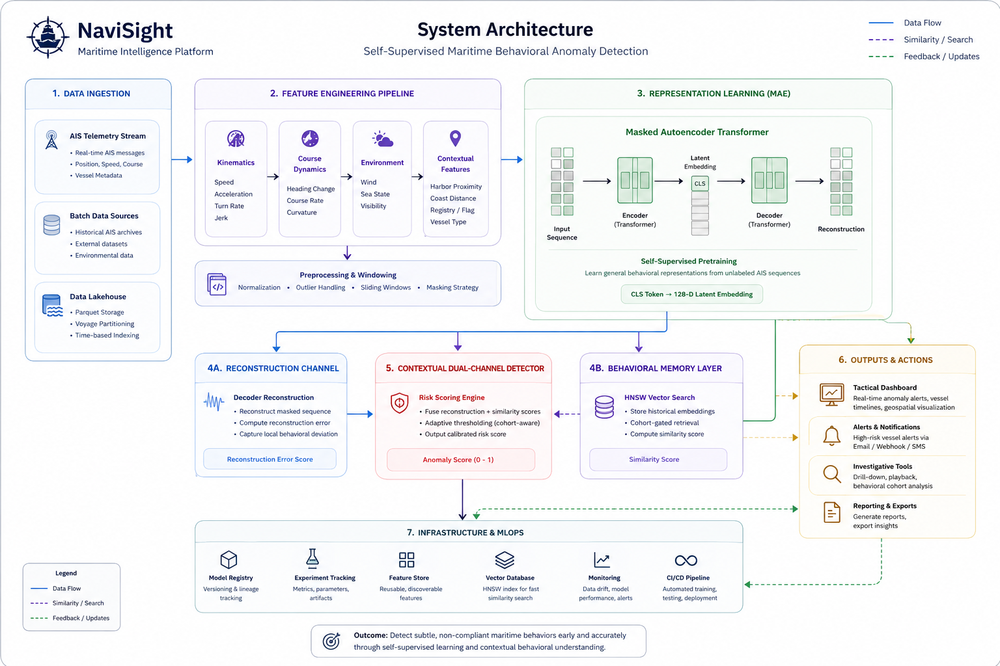
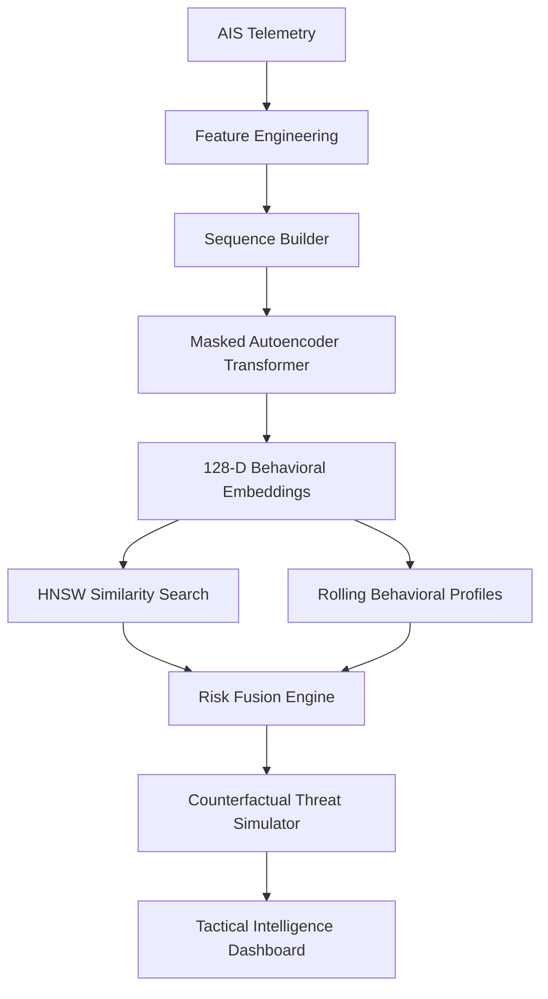
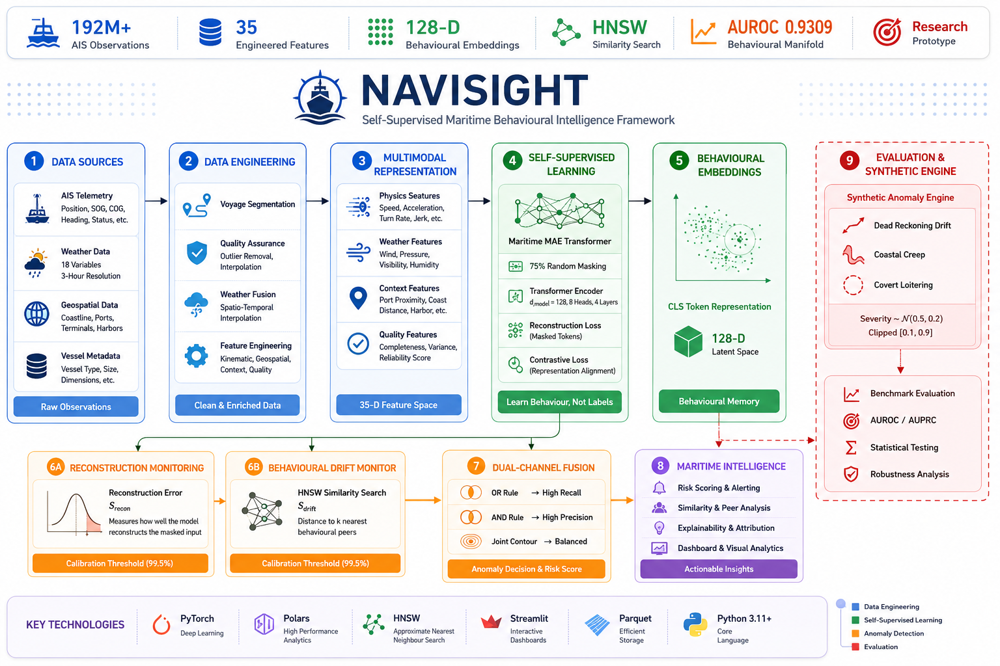
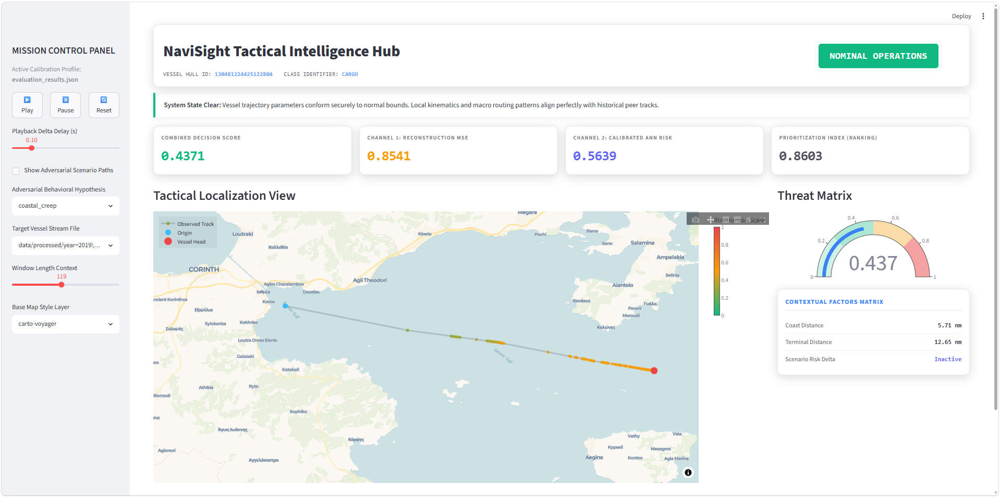
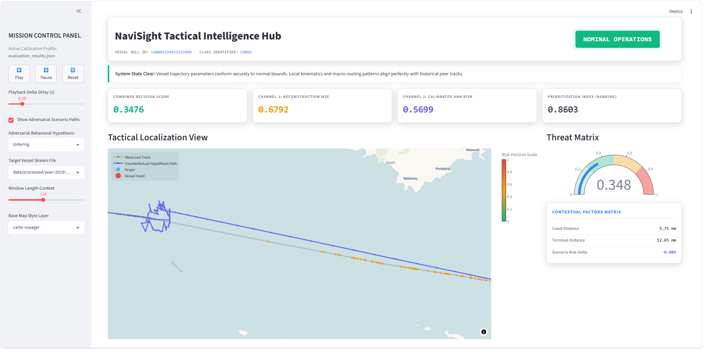
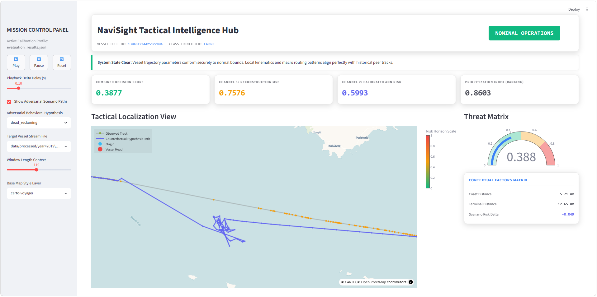

# 🛰️ NaviSight

<div align="center">

### Geospatial Behavioral Intelligence Platform for Maritime Anomaly Detection

Self-Supervised Learning • Behavioral Representation Learning • HNSW Similarity Search • Explainable AI • Counterfactual Threat Simulation • Maritime Intelligence


</div>

---

# Table of Contents

- [Executive Summary](#executive-summary)
- [Project Status](#project-status)
- [Benchmark Results](#benchmark-results)
- [Skills Demonstrated](#skills-demonstrated)
- [Associated Publication](#associated-publication)
- [Author](#author)
- [Citation](#citation)
- [Mission](#mission)
- [Overview](#overview)

- [Why NaviSight Matters](#why-navisight-matters)
  - [What Makes NAVISIGHT Different?](#what-makes-navisight-different)
  - [Scale of the Study](#scale-of-the-study)
  - [Reproducibility](#reproducibility)

- [Dataset & Data Engineering](#-dataset--data-engineering)
  - [AIS Maritime Telemetry Corpus](#ais-maritime-telemetry-corpus)
  - [Exploratory Dataset Statistics](#exploratory-dataset-statistics)
  - [AIS Signals](#ais-signals)
  - [Geospatial Intelligence Layer](#geospatial-intelligence-layer)
  - [Meteorological Intelligence Layer](#meteorological-intelligence-layer)
    - [Weather Dataset Statistics](#weather-dataset-statistics)
    - [Weather Variables](#weather-variables)
    - [Environmental Feature Derivation](#environmental-feature-derivation)

- [Feature Engineering Pipeline](#-feature-engineering-pipeline)
  - [Feature Registry Summary](#feature-registry-summary)

- [Training Corpus Construction](#-training-corpus-construction)
  - [Why the Dataset Matters](#why-the-dataset-matters)

- [Key Capabilities](#key-capabilities)

- [Architecture](#architecture)
  - [High-Level System Architecture](#high-level-system-architecture)
  - [System Flow](#system-flow)
  - [Mermaid Architecture Diagram](#mermaid-architecture-diagram)

- [NAVISIGHT Methodology](#navisight-methodology)
  - [Stage 1 — Self-Supervised Representation Learning](#stage-1--self-supervised-representation-learning)
  - [Stage 2 — Behavioral Memory Construction](#stage-2--behavioral-memory-construction)
  - [Stage 3 — Dual-Channel Anomaly Detection](#stage-3--dual-channel-anomaly-detection)

- [Research Contributions](#research-contributions)
  - [1. Self-Supervised Maritime Representation Learning](#1-self-supervised-maritime-representation-learning)
  - [2. Cohort-Gated Similarity Search](#2-cohort-gated-similarity-search)
  - [3. Rolling Behavioral Profiles](#3-rolling-behavioral-profiles)
  - [4. Counterfactual Threat Simulation](#4-counterfactual-threat-simulation)

- [Model Card v1.0](#model-card-v10)
  - [Model Name](#model-name)
  - [Version](#version)
  - [Model Type](#model-type)
  - [Objective](#objective)
  - [Model Overview](#model-overview)
  - [Inputs](#inputs)
  - [Outputs](#outputs)
    - [Behavioral Embedding](#behavioral-embedding)
    - [Risk Score](#risk-score)
    - [Threat Classification](#threat-classification)
  - [Downstream Tasks](#downstream-tasks)
  - [Intended Use](#intended-use)
  - [Limitations](#limitations)

- [Evaluation Framework](#evaluation-framework)
  - [Calibration](#calibration)
  - [Metrics](#metrics)

- [Engineering Challenges Solved](#engineering-challenges-solved)
  - [Scaling Massive AIS Datasets](#scaling-massive-ais-datasets)
  - [Fast Behavioral Similarity Search](#fast-behavioral-similarity-search)
  - [Reducing False Positives](#reducing-false-positives)
  - [Explainability](#explainability)

- [Behavioral Embedding Space](#behavioral-embedding-space)

- [Similarity Search Engine](#similarity-search-engine)
  - [ANN Backend](#ann-backend)
  - [Stored Metadata](#stored-metadata)

- [Counterfactual Threat Simulation](#counterfactual-threat-simulation)
  - [Covert Loitering](#covert-loitering)
  - [Dead Reckoning Drift](#dead-reckoning-drift)
  - [Coastal Creep](#coastal-creep)

- [Tactical Intelligence Hub](#tactical-intelligence-hub)
  - [Threat Assessment](#threat-assessment)
  - [Tactical Navigation View](#tactical-navigation-view)
  - [Behavioral Analytics](#behavioral-analytics)
  - [Similarity Intelligence](#similarity-intelligence)

- [Dashboard Preview](#dashboard-preview)
  - [Screenshots](#screenshots)

- [Repository Structure](#repository-structure)

- [System Metrics](#system-metrics)

- [Technology Stack](#technology-stack)

- [Quick Start](#quick-start)
  - [Clone the Repository](#1-clone-the-repository)
  - [Install Dependencies](#2-install-dependencies)
  - [Clean Previous Artifacts](#3-clean-previous-artifacts)
  - [Compute Global Statistics](#4-compute-global-statistics)
  - [Run the Training Pipeline](#5-run-the-training-pipeline)
  - [Build Embeddings](#6-build-embeddings)
  - [Run the Evaluation Pipeline](#7-run-the-evaluation-pipeline)
  - [Launch Dashboard](#8-launch-dashboard)

- [Engineering Tradeoffs](#engineering-tradeoffs)
  - [Why HNSW Instead of FAISS IVF?](#why-hnsw-instead-of-faiss-ivf)
  - [Why Self-Supervised Learning?](#why-self-supervised-learning)

- [Design Decisions](#design-decisions)
  - [Decision #1](#decision-1)
  - [Decision #2](#decision-2)
  - [Decision #3](#decision-3)

- [Lessons Learned Building NaviSight](#lessons-learned-building-navisight)

- [Example Workflow](#example-workflow)

- [Future Work](#future-work)

- [Academic Inspiration](#academic-inspiration)

- [Contributing](#contributing)

- [License](#license)

- [Acknowledgements](#acknowledgements)

---
# Executive Summary

NaviSight is a behavioral intelligence platform for maritime anomaly detection built around self-supervised representation learning.

The system transforms raw AIS telemetry into latent behavioral embeddings using a Masked Autoencoder Transformer and detects anomalous activity through cohort-aware similarity search, behavioral profiling, and contextual risk fusion.

The architecture was designed to answer a fundamental question:

> Can vessel behavior itself become the primary signal for maritime threat detection?

Rather than relying on manually engineered rules, NaviSight learns behavioral manifolds directly from historical trajectories and identifies deviations in latent space.

The platform combines:

- Self-Supervised Transformers
- Geospatial Feature Engineering
- Behavioral Embedding Learning
- HNSW Similarity Search
- Rolling Profile Modeling
- Counterfactual Threat Simulation
- Explainable Risk Attribution

into a unified operational intelligence system.

The result is a framework capable of detecting subtle behavioral anomalies that would remain invisible to threshold-based monitoring systems.

---
# Project Status

| Item | Status |
|--------|--------|
| Research Paper | Submitted to Ocean Engineering (2026) |
| Codebase | Public |
| Reproducibility | Supported |
| Documentation | Active |
| License | Apache 2.0 |
| Development Status | Research Prototype |

---
# Benchmark Results

NAVISIGHT was evaluated on approximately 192 million AIS observations from the Aegean Sea.

Key results:

| Method | AUROC |
|----------|--------|
| One-Class SVM | 0.5007 |
| LOF | 0.5431 |
| Isolation Forest | 0.6252 |
| LSTM AutoEncoder | 0.5617 |
| NAVISIGHT Reconstruction | 0.8737 |
| NAVISIGHT Behavioural Drift | 0.9309 |

Evaluation followed a strictly chronological train-calibration-test protocol.

---
# Skills Demonstrated

This project demonstrates experience in:

- Self-Supervised Learning
- Transformer Architectures
- Representation Learning
- Geospatial Analytics
- Time-Series Modelling
- Feature Engineering
- Large-Scale Data Processing
- Approximate Nearest Neighbour Search
- Explainable AI
- Scientific Software Engineering
- Maritime Domain Intelligence

---
# Associated Publication

**NAVISIGHT: A Self-Supervised Maritime Anomaly Detection Framework for AIS Trajectories**

Submitted to:

**Ocean Engineering**
Special Issue:
*Ocean-Aware Detection and Tracking in Maritime Environments*

Status:
**Under Review (2026)**

The repository contains the implementation used to produce the results reported in the manuscript.

**Disclaimer**: This repository is released independently of the review process.
Public code availability does not imply acceptance of the associated manuscript.

---
# Author

### Anil Kumar Korupoju

AI Engineer • Machine Learning Engineer • Applied AI Research Enthusiast

Focused on:

- Representation Learning
- Self-Supervised Sequence Systems
- RAG Systems
- Agentic AI
- Geospatial Intelligence
- Large Language Models
- Anomaly Detection

---

# Citation

If you use NAVISIGHT in academic work, please cite:

```bibtex
@article{korupoju2026navisight,
  title={NAVISIGHT: A Self-Supervised Maritime Anomaly Detection Framework for AIS Trajectories},
  author={Korupoju, Anil Kumar},
  journal={Ocean Engineering},
  year={2026},
  note={Under Review}
}
```
---

# Mission

NaviSight exists to transform maritime monitoring from rule-based alerting into behavioral intelligence.

The long-term objective is to build systems capable of understanding how vessels behave, not simply where they are.

By learning latent behavioral patterns directly from telemetry, NaviSight aims to enable earlier detection of emerging maritime threats while reducing analyst workload.

---
# Overview

NaviSight is an end-to-end maritime behavioral intelligence platform that learns latent vessel behavior directly from AIS telemetry and detects anomalous activity using self-supervised representation learning, cohort-aware similarity search, rolling behavioral profiling, and contextual risk fusion.

Unlike traditional maritime monitoring systems that depend on manually crafted rules and thresholds, NaviSight learns behavioral manifolds from historical vessel movement patterns and identifies deviations through representation-space reasoning.

The platform combines:

- Self-Supervised Masked Autoencoder Transformers
- Behavioral Embedding Learning
- Cohort-Gated HNSW Similarity Search
- Rolling Vessel Behavior Profiling
- Dual-Channel Contextual Risk Fusion
- Counterfactual Threat Simulation
- Explainable Anomaly Analysis Dashboard

to create a modern behavioral intelligence framework for maritime anomaly detection.

---

# Why NaviSight Matters

## What Makes NAVISIGHT Different?

Unlike conventional maritime anomaly detection systems,
NAVISIGHT combines:

- Self-supervised representation learning
- Multimodal AIS + weather + geospatial fusion
- Behavioural manifold monitoring
- Approximate nearest-neighbour retrieval
- Counterfactual anomaly simulation
- Explainable anomaly analysis

within a single end-to-end framework.

Most maritime anomaly systems focus on trajectories.

NAVISIGHT focuses on behaviour.

---
NaviSight demonstrates how modern self-supervised learning, approximate nearest-neighbour search, geospatial analytics, and maritime domain knowledge can be combined into a unified anomaly detection framework.

The project was developed as both a research contribution and an exploration of scalable behavioural AI for real-world maritime surveillance systems.

More than 80% of global trade travels by sea.

Every day, millions of AIS transmissions are generated by vessels operating across:

- international shipping lanes
- territorial waters
- ports
- coastal regions
- offshore facilities

Most monitoring systems still rely on:

- static rules
- speed thresholds
- geofencing alerts
- manually engineered heuristics

These approaches struggle to detect:

- covert loitering
- route manipulation
- smuggling activity
- AIS spoofing
- deceptive navigation
- slow behavioral drift

Traditional systems ask:

> Did the vessel violate a predefined rule?

NaviSight asks:

> Does the vessel still behave like vessels that belong to its behavioral cohort?

This shifts anomaly detection from rule matching to behavioral intelligence.

Rather than relying on fixed thresholds, NaviSight learns normal vessel behavior directly from historical trajectories and identifies subtle deviations that may indicate emerging threats.

## Scale of the Study

| Statistic | Value |
|------------|---------|
| AIS Records | ~192 Million |
| Evaluation Windows | 262,287 |
| Calibration Windows | 309,268 |
| Transformer Forward Passes | 833,000+ |
| Embedding Dimension | 128 |
| ANN Backend | HNSW |
| Feature Count | 35 |

## Reproducibility

The published results were generated using:

- Python 3.11
- PyTorch 2.5
- CUDA 12.1
- Random seed 42
- Chronological train-calibration-test split

Key model parameters:

| Parameter | Value |
|------------|---------|
| Sequence Length | 60 |
| Mask Ratio | 75% |
| Embedding Dimension | 128 |
| Transformer Layers | 4 |
| Attention Heads | 8 |
| Batch Size | 256 |
| Optimizer | AdamW |
| Random Seed | 42 |


---

# 📊 Dataset & Data Engineering

## AIS Maritime Telemetry Corpus

NaviSight is trained on large-scale Automatic Identification System (AIS) telemetry collected from commercial maritime traffic operating within the Eastern Mediterranean maritime domain.

The dataset captures vessel movement behavior at scale and serves as the foundation for self-supervised behavioral representation learning.

---

## Exploratory Dataset Statistics

The following statistics correspond to AIS telemetry snapshot used for exploratory analysis, feature validation, and data quality assessment.

| Attribute | Value |
|------------|---------|
| AIS Observations | **~192 Million** |
| Calibration Windows | 309,268 |
| Evaluation Windows | 262,287 |
| Geographic Region | Aegean Sea |
| Coverage Area | Piraeus Maritime Domain |
| Data Type | Vessel Telemetry |
| Learning Paradigm | Self-Supervised |
| Sequence Length | 60 Steps |
| Engineered Features | 35 |
| Embedding Dimension | 128 |
| ANN Backend | HNSW |
| Storage Format | Partitioned Parquet |
| Inference Backend | PyTorch |

> Dataset statistics generated from exploratory profiling and validation pipelines.

---

## AIS Signals

Raw vessel telemetry includes:

- Latitude
- Longitude
- Speed Over Ground (SOG)
- Course Over Ground (COG)
- Heading
- Navigation Status
- Timestamp
- Vessel Metadata
- Voyage Context

These signals are transformed into a high-dimensional behavioral representation through extensive feature engineering.

---

## Geospatial Intelligence Layer

NaviSight augments vessel telemetry with operational maritime context.

Derived geospatial features include:

- Distance to Coast
- Distance to Port
- Distance to Terminal
- Harbor Proximity
- Land Ingress Detection
- Voyage Phase Indicators
- Spatial Density Features
- Regional Context Encoding

This enables the model to reason not only about vessel motion but also about environmental and operational conditions.

---

## Meteorological Intelligence Layer

To model vessel behavior under realistic operating conditions, AIS trajectories are fused with spatiotemporal weather data.

---

### Weather Dataset Statistics

| Attribute | Value |
|------------|---------|
| Records | 10,800 |
| Temporal Coverage | September 2018 |
| Time Resolution | 6-Hour Intervals |
| Spatial Representation | Rectilinear Grid |
| Weather Variables | 18 |
| Interpolation Strategy | Trilinear Spatiotemporal Interpolation |

---

### Weather Variables

NaviSight incorporates:

| Variable | Description |
|-----------|-------------|
| TMP | Temperature |
| RH | Relative Humidity |
| PRMSL | Mean Sea Level Pressure |
| VIS | Visibility |
| WSPD | Wind Speed |
| GUST | Wind Gust |
| UGRD | Zonal Wind Component |
| VGRD | Meridional Wind Component |
| DPT | Dew Point |
| APCP | Accumulated Precipitation |

---

### Environmental Feature Derivation

Weather observations are transformed into vessel-centric behavioral features:

- Headwind Component
- Crosswind Component
- Environmental Resistance
- Visibility Exposure
- Weather Severity Indicators
- Atmospheric Stability Signals

This allows the behavioral encoder to distinguish operational behavior from weather-driven motion changes.

---

# 🧠 Feature Engineering Pipeline

```text
Raw AIS Telemetry
        │
        ▼

Trajectory Cleaning
        │
        ▼

Voyage Segmentation
        │
        ▼

Kinematic Feature Extraction
        │
        ├── Speed
        ├── Acceleration
        ├── Turn Rate
        ├── Jerk
        └── Heading Dynamics

        │
        ▼

Geospatial Enrichment
        │
        ├── Port Distance
        ├── Coast Distance
        ├── Harbor Features
        └── Terminal Context

        │
        ▼

Weather Fusion
        │
        ├── Wind Speed
        ├── Gusts
        ├── Visibility
        ├── Pressure
        └── Humidity

        │
        ▼

Temporal Context Encoding
        │
        ├── Hour-of-Day
        ├── Day-of-Week
        └── Voyage Phase

        │
        ▼

35-Dimensional Feature Space
```
---

## Feature Registry Summary

NaviSight's feature registry currently spans four primary domains:

| Category | Purpose |
|-----------|---------|
| Kinematic Features | Vessel motion dynamics |
| Geospatial Features | Environmental context |
| Weather Features | Operational conditions |
| Quality-Control Features | Data reliability signals |

This multimodal representation enables the system to learn behavioral manifolds rather than relying solely on trajectory geometry.


| Domain | Features |
|----------|----------|
| Physics | 13 |
| Weather | 9 |
| Context | 8 |
| Quality | 5 |
| Total | 35 |

---

# 📈 Training Corpus Construction

```text
192M+ AIS Observations
          │
          ▼

Trajectory Segmentation
          │
          ▼

Window Generation
          │
          ▼

60-Step Sequences
          │
          ▼

Masked Token Corruption
          │
          ▼

Self-Supervised Training
          │
          ▼

Transformer Encoder
          │
          ▼

128-D Behavioral Embeddings
```

---

## Why the Dataset Matters

Most maritime anomaly detection systems focus exclusively on:

- positional tracks
- speed thresholds
- geofencing rules

NaviSight instead learns from a richer behavioral state space combining:

```text
Movement
      +
Environment
      +
Weather
      +
Context
      +
Historical Behavior
```

This enables detection of subtle anomalies that may remain invisible to traditional rule-based monitoring systems.

---
# Key Capabilities

### Behavioral Representation Learning

Learn compact latent representations of vessel behavior.

### Similarity-Based Intelligence

Compare vessels against historical behavioral peers rather than global populations.

### Explainable Risk Assessment

Surface risk drivers and nearest historical behavioral matches.

### Counterfactual Threat Simulation

Generate realistic adversarial vessel trajectories.

### Operational Dashboard

Interactive intelligence hub for monitoring, validation, and analysis.

---

# Architecture

## High-Level System Architecture



---

## System Flow

```text
Raw AIS Telemetry
        │
        ▼
Geospatial Feature Engineering
        │
        ▼
Sequence Construction
        │
        ▼
Masked Autoencoder Transformer
        │
        ▼
128-D Behavioral Embeddings
        │
 ┌──────┴──────────────┐
 ▼                     ▼

HNSW Index       Behavior Profiles
 │                     │
 └──────────┬──────────┘
            ▼

Dual-Channel Detector
            │
            ▼

Counterfactual Simulator
            │
            ▼

Interactive Maritime Analytics Dashboard
```

---

## Mermaid Architecture Diagram


---

# NAVISIGHT Methodology



The framework operates in three stages:

## Stage 1 — Self-Supervised Representation Learning

AIS trajectories are transformed into multimodal behavioral sequences
containing:

- Kinematic features
- Environmental features
- Contextual features
- Data quality features

A Maritime Masked Autoencoder is trained using:

- Reconstruction loss
- Contrastive consistency loss

to learn vessel behavior embeddings without anomaly labels.

---

## Stage 2 — Behavioral Memory Construction

Trajectory embeddings are:

- L2 normalized
- Indexed using HNSW
- Stored as behavioral memory

This enables efficient retrieval of historically similar vessel behavior.

---

## Stage 3 — Dual-Channel Anomaly Detection

Two complementary anomaly signals are computed:

### Reconstruction Channel

Measures local trajectory reconstruction failure.

### Behavioral Drift Channel

Measures distance from historical behavioral neighbors.

The final anomaly score is obtained through calibrated fusion.


---

# Research Contributions

NaviSight introduces several architectural concepts inspired by modern representation learning and behavioral intelligence systems.

---

## 1. Self-Supervised Maritime Representation Learning

Rather than training directly on anomaly labels, NaviSight learns vessel behavior through reconstruction objectives.

Benefits:

- reduced labeling requirements
- improved generalization
- richer latent representations

---

## 2. Cohort-Gated Similarity Search

Instead of comparing all vessels globally, NaviSight isolates comparisons to behaviorally similar vessel classes.

Benefits:

- lower false positive rates
- improved contextual relevance
- more meaningful peer comparisons

---

## 3. Rolling Behavioral Profiles

Historical behavior is continuously tracked using exponentially weighted profile updates.

Benefits:

- adaptive baselines
- temporal awareness
- behavior drift detection

---

## 4. Counterfactual Threat Simulation

The system can inject realistic behavioral perturbations.

Examples:

- Covert Loitering
- Dead Reckoning Drift
- Coastal Creep

Benefits:

- validation
- robustness testing
- explainability

---

# Model Card v1.0

## Model Name

NaviSight Maritime Behavioral Encoder

---

## Version

v1.0

---

## Model Type

Masked Autoencoder Transformer

---

## Objective

Learn vessel behavioral representations from AIS trajectories.

---

## Model Overview

| Attribute | Value |
|------------|---------|
| Model Type | Masked Autoencoder Transformer |
| Learning Paradigm | Self-Supervised |
| Domain | Maritime AIS |
| Embedding Dimension | 128 |
| Input Type | Sequential Telemetry |
| Output | Behavioral Embedding |

---

## Inputs

60-step telemetry sequences.

Features include:

- position
- velocity
- heading
- turn rate
- harbor proximity
- coast distance
- terminal distance
- derived motion features

---

## Outputs

### Behavioral Embedding

```text
128-dimensional latent representation
```

### Risk Score

```text
0.0 → 1.0
```

### Threat Classification

```text
NOMINAL
WARNING
CRITICAL
```

---

## Downstream Tasks

- Anomaly Detection
- Vessel Similarity Search
- Threat Assessment
- Behavioral Clustering
- Operational Monitoring

---

## Intended Use

Operational maritime intelligence.

---

## Limitations

- dependent on AIS quality
- vulnerable to missing transmissions
- limited environmental context

---

# Evaluation Framework

NAVISIGHT follows a strictly chronological evaluation protocol.

| Period | Purpose |
|----------|----------|
| Jan 2018 – Jun 2019 | Training |
| Jul 2019 – Sep 2019 | Calibration |
| Oct 2019 – Dec 2019 | Testing |

This prevents temporal leakage and evaluates generalization to future vessel traffic patterns.

---

## Calibration

Thresholds are estimated from the calibration period using the 99.5th percentile.

No manually tuned thresholds are used.

---

## Metrics

- AUROC
- AUPRC
- Precision
- Recall
- F1 Score
- Confusion Matrix

---
# Engineering Challenges Solved

---

## Scaling Massive AIS Datasets

### Challenge

Global AIS telemetry contains hundreds of millions of records.

### Solution

Partitioned Parquet Lakehouse architecture.

Benefits:

- efficient storage
- lazy loading
- parallel processing

---

## Fast Behavioral Similarity Search

### Challenge

Exhaustive pairwise vessel comparison is computationally infeasible.

### Solution

Hierarchical Navigable Small World (HNSW) graphs.

Benefits:

- logarithmic search complexity
- real-time retrieval
- scalable indexing

---

## Reducing False Positives

### Challenge

Different vessel classes naturally exhibit different behaviors.

### Solution

Cohort-Gated ANN Search.

Benefits:

- class-aware comparisons
- stronger contextual relevance

---

## Explainability

### Challenge

Deep anomaly models are often opaque.

### Solution

Risk attribution engine.

Provides:

- nearest historical matches
- feature contributions
- counterfactual validation

---

# Behavioral Embedding Space

Every trajectory window is transformed into:

```text
Trajectory
      ↓
Transformer Encoder
      ↓
CLS Token
      ↓
128-D Embedding
```

The embedding captures:

- movement style
- route characteristics
- maneuvering behavior
- environmental interaction

---

# Similarity Search Engine

## ANN Backend

```text
HNSW
```

## Stored Metadata

Each embedding tracks:

```text
embedding_id
vessel_id
timestamp
trip_id
superclass
```

allowing traceability from latent vectors back to raw trajectories.

---

# Counterfactual Threat Simulation

NaviSight contains a dedicated adversarial simulation engine.

---

## Covert Loitering

Simulates circular holding patterns.

Use cases:

- surveillance
- rendezvous behavior
- illegal waiting

---

## Dead Reckoning Drift

Simulates deceptive heading drift.

Use cases:

- AIS spoofing
- route manipulation

---

## Coastal Creep

Simulates constrained coastal movement.

Use cases:

- smuggling
- illegal fishing
- shoreline monitoring

---

# Tactical Intelligence Hub

The platform includes a professional operational dashboard.

---

## Threat Assessment

Features:

- live risk scoring
- anomaly classification
- behavioral diagnostics

---

## Tactical Navigation View

Interactive geospatial intelligence map.

Displays:

- observed route
- simulated route
- vessel status
- environmental context

---

## Behavioral Analytics

Trend visualization:

- speed
- heading
- course
- maneuvering dynamics

---

## Similarity Intelligence

Displays:

- nearest behavioral neighbors
- embedding distance
- similarity confidence

---

# Dashboard Preview

```text
assets/
├── dashboard_overview.png
├── dashboard_loitering.png
├── dashboard_deadreckoning.png
├── dashboard_coastalcreep.png
├── navisight_methodology.png
├── navisight_architecture.png
```
---
## Screenshots






---

# Repository Structure

```text
navisight/

├── configs/
│
├── data/
│   ├── raw/
│   ├── processed/
│   └── embeddings/
│
├── models/
│   ├── checkpoints/
│   └── state/
│
├── navisight/
│
│   ├── pipeline/
│   │
│   ├── training/
│   │
│   ├── evaluation/
│   │
│   ├── feature_registry/
│   │
│   ├── geospatial/
│   │
│   ├── embeddings/
│   │
│   └── inference/
│
├── scripts/
│   ├── train.py
│   ├── evaluate.py
│   ├── generate_embeddings.py
│   └── view_validation_dashboard.py
│
├── assets/
│
├── requirements.txt
├── README.md
└── LICENSE
```

---

# System Metrics

| Metric | Value |
|----------|---------|
| Embedding Size | 128 |
| Sequence Length | 60 |
| ANN Backend | HNSW |
| Storage Format | Parquet |
| Inference Framework | PyTorch |
| Dashboard | Streamlit |
| Analytics Engine | Polars |
| Search Complexity | O(log N) |

---

# Technology Stack

| Layer | Technology |
|---------|------------|
| Deep Learning | PyTorch |
| Dashboard | Streamlit |
| Data Processing | Polars |
| Visualization | Plotly |
| Similarity Search | HNSW |
| Storage | Parquet |
| Numerical Computing | NumPy |
| Language | Python |

---

# Quick Start

## 1. Clone the Repository

```bash
git clone https://github.com/yourusername/navisight.git

cd navisight
```

---

## 2. Install Dependencies

```bash
pip install -r requirements.txt
```

---

## 3. Clean Previous Artifacts

Remove legacy embeddings, processed data, and index files to ensure a fresh run.

```bash
rm -rf data/embeddings/* data/processed/* models/state/index/*
```

---

## 4. Compute Global Statistics

Initialize the geospatial normalization statistics used throughout the pipeline.

```bash
python scripts/compute_global_stats.py
```

---

## 5. Run the Training Pipeline

Process raw telemetry, resample trajectories, and generate the processed dataset.

```bash
python scripts/train_pipeline.py
```

---

## 6. Build Embeddings

Generate latent representations and create the initial embedding index.

```bash
python scripts/build_embeddings.py
```

---

## 7. Run the Evaluation Pipeline

Populate the class-specific HNSW indices and prepare the retrieval database.

```bash
python scripts/eval_pipeline.py
```

---

## 8. Launch Dashboard

```bash
streamlit run dashboard/view_validation_dashboard.py
```

---
# Engineering Tradeoffs

## Why HNSW Instead of FAISS IVF?

### HNSW Advantages

- lower retrieval latency
- excellent recall
- dynamic insertions

### Tradeoff

Higher memory consumption.

Decision:

Prioritized retrieval quality and operational latency.

---

## Why Self-Supervised Learning?

### Advantages

- minimal labeling requirements
- better scalability

### Tradeoff

Interpretability challenges.

Decision:

Added explainability layers through similarity retrieval and feature attribution.

---

# Design Decisions

## Decision #1

Behavior First, Rules Second

Traditional systems:

Rule → Alert

NaviSight:

Behavior → Embedding → Risk

---

## Decision #2

Cohort-Aware Similarity

Rejected:

Global vessel comparisons.

Implemented:

Superclass-isolated HNSW indices.

Reason:

Different vessel classes exhibit fundamentally different movement patterns.

---

## Decision #3

Explainability as a First-Class Citizen

Every anomaly score must be traceable through:

- nearest neighbors
- feature attribution
- counterfactual simulation


---
# Lessons Learned Building NaviSight

### 1. Data Engineering Matters More Than Models

Most gains came from improving trajectory quality rather than increasing model complexity.

---

### 2. Similarity Search Is Surprisingly Powerful

Many anomalies become obvious when viewed through behavioral neighbors.

---

### 3. Explainability Cannot Be Added Later

Operational users require trust before they accept anomaly alerts.

---

### 4. Synthetic Scenarios Are Essential

Counterfactual simulation revealed failure modes that traditional evaluation never exposed.

---

### 5. Maritime Behavior Is Highly Contextual

The same trajectory may be normal for one vessel class and anomalous for another.

---
# Example Workflow

```text
AIS Data
    ↓

Feature Engineering
    ↓

Embedding Generation
    ↓

ANN Indexing
    ↓

Behavior Profiling
    ↓

Threat Detection
    ↓

Dashboard Visualization
```

---

# Future Work

### Planned Improvements

- Graph Neural Networks
- Multi-Vessel Interaction Modeling
- Online Learning
- Satellite Data Fusion
- Global Traffic Forecasting
- Streaming Inference
- Distributed HNSW Infrastructure
- Explainable Attention Maps
- Real-Time Alerting

### Target use cases:

- Maritime Security
- Illegal Fishing Detection
- Port Intelligence
- Offshore Asset Monitoring
- Trade Route Analysis

---

# Academic Inspiration

Relevant fields:

- Representation Learning
- Self-Supervised Learning
- Geospatial AI
- Maritime Informatics
- Anomaly Detection
- Approximate Nearest Neighbor Search
- Explainable AI

---

# Contributing

Contributions are welcome.

Areas of interest:

- anomaly detection
- geospatial analytics
- transformer architectures
- behavioral modeling
- visualization
- performance optimization

---

# License

Licensed under the Apache 2.0 License.

---

# Acknowledgements

Built using open-source technologies from:

- PyTorch
- Streamlit
- Plotly
- Polars
- NumPy

and inspired by research across:

- Self-Supervised Learning
- Geospatial Intelligence
- Maritime Analytics
- Behavioral Modeling

---

If you found NaviSight useful:

⭐ Star the repository

🍴 Fork the project

🛰️ Build the future of maritime intelligence
